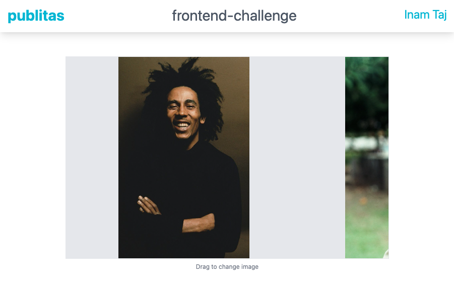

# publitas-slider
> Slider which renders images of different dimensions in HTML `<canvas>` component

## How to run the app

1. Clone via `git clone`

### Pre-built app

* Install `npm i serve` as http server
* Run `serve -s build -l 8088`
* Open `http://localhost:8088` to view the app

### Fresh build
* Install dependencies `yarn install`
* Run via `yarn serve`

## Scope of Work

- [x] Code is in Typescript and React.js
- [x] Implements a generic slider component which takes urls as `images` and canvas `width` and `height`
- [x] Images are scaled to fit in the viewport without compromising on aspect-ratio
- [x] Makes the images draggable on x-axis from left to right _(with limitations)_
- [x] Cursor style is changed based on dragging state of component

### Screenshot

## Future Improvements

- [ ] On drag, calculate new `x` correctly so that all right images can be dragged towards left completely
- [ ] Image flashes should be removed when dragging

## Dev Notes

In the project directory, you can run:

### `yarn start`

Runs the app in the development mode.\
Open [http://localhost:3000](http://localhost:3000) to view it in the browser.

### `yarn build`

Builds the app for production to the `build` folder.\
Your app is ready to be deployed!
